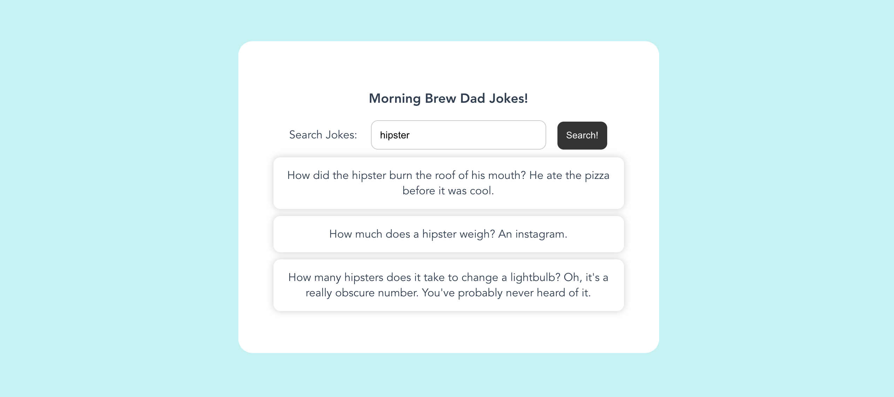

# Morning Brew Dad Joke Project

Welcome to the takehome project! We're excited to see some code you write.
In this project you'll query the dad joke API documented below and display the resulting jokes in a list.

Documentation for the API:
https://icanhazdadjoke.com/api#search-for-dad-jokes

You can develop the app in a frontend framework of your choice (React, Vue, etc.). We know you are busy so please
don't feel obligated to spend more than 1-2 hours on this project.

In your 1-hour technical interview we will do a code review and discuss the project. Please be prepared to share
your screen and go over your code.

App Requirements:
 - An input to enter search term.
 - A button that searches when clicked.
 - If jokes are found for the search term, display them in a list below.
 - If no jokes are found for the search term, display "No jokes found" below.
 - The app should be checked into a git repository that can be shared with us.

Bonus Points (definitely not required):
 - You don't have to write tests but please be prepared to discuss what sort of testing would be applicable.
 - Paginated jokes.
 - Add ability to "like" and/or "discard" jokes in the list.
 - Deploy your app to Vercel, Netlify, or other CDN.
 - Feel free to get creative or add any other UI/UX you think helps.

Example App:

